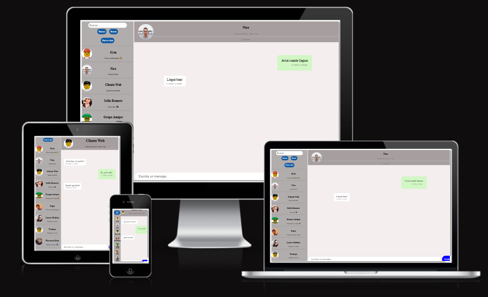

# 📘 Trabajo Final Integrador – Angular - Módulo 1 | Unidad 4

Este proyecto corresponde al **Trabajo Final Integrador de la Unidad 4 del Módulo 1** de la Diplomatura Full Stack.

Se desarrolló un **simulador de chat** utilizando una arquitectura basada en **componentes, servicios y pipes**, donde estos últimos se emplean para mostrar información como la **última conexión** y la **fecha de los mensajes**. Además, la aplicación permite la **creación de nuevos chats** y la **asignación de imágenes mediante una URL genérica** y permite **buscar** el chat por el nombre.

Para el diseño visual, se utilizaron **plantillas CSS individuales por componente**, permitiendo una mejor organización y mantenimiento de estilos.  
La **base de datos** está representada mediante un **mock con datos precargados**, lo que facilita la simulación del funcionamiento del sistema sin necesidad de un backend real.

Los distintos componentes fueron unificados a través de un **componente Layout**, con el objetivo de ofrecer una **interfaz clara y amigable para el usuario**.  
Además, la aplicación fue desarrollada con **diseño responsive**, adaptándose correctamente a diferentes dispositivos y tamaños de pantalla.

Finalmente, el proyecto fue **desplegado en la plataforma Vercel**, permitiendo su visualización y acceso en línea.

---

## Como ver el proyecto

1. Clonar repositorio

```
 git clone https://github.com/JDamianDelgado/Angular-TrabajoFinal-Chat-UTN.git
```

2. Instalar dependencias

```
npm install
```

3. Ejecutar el Proyecto

```
npm run start
```

El proyecto debe correr localmente en 'http://localhost:4200/' por defecto

Desplegado en : [Vercel](https://angular-trabajo-final-chat-utn.vercel.app/)

## Autor

Nombre: Joaquín Damián Delgado

Curso: Diplomatura Full Stack

Unidad: Módulo 1 – Unidad 4 - Angular

Fecha: Enero 2026

## Capturas

### Pantalla Responsive


